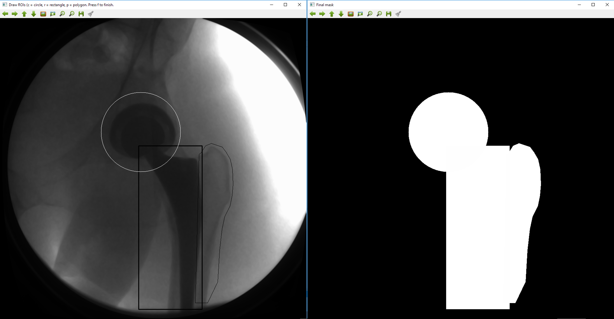
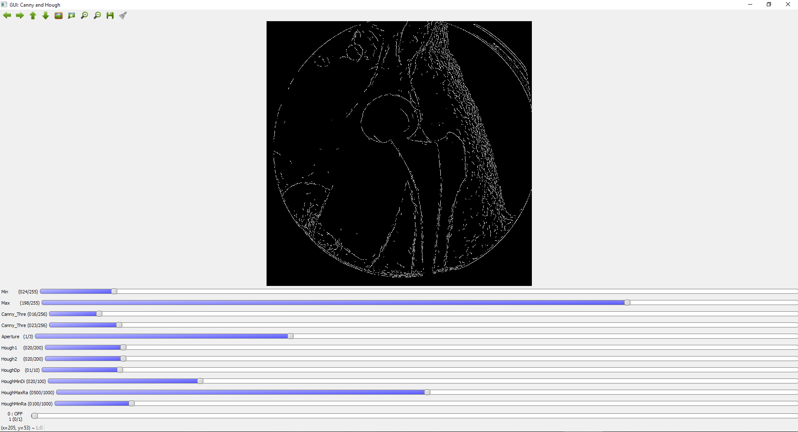
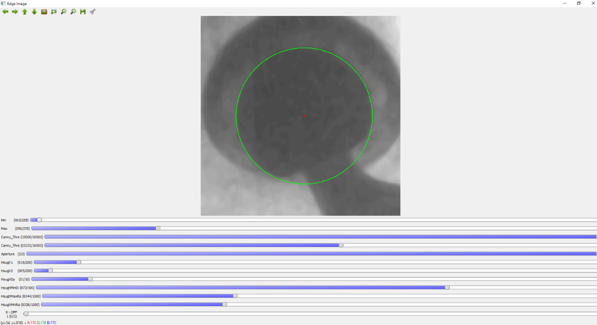

# A GUI for pre-processing of X-ray images for image registration.

The GUI allows to:
- Draw a mask in order to select specific areas in the image (ROI), by composing self-selected rectangels, circles and polygons.
- Extract edges with interactive Canny edge detection
- Fit a circle to the acetabluar cup with interactive Hough transform

# Usage

1) Run "python HipHopGUI.py input_data\\C_g1_001_denoised.tif"

2) Draw a mask: draw a rectangle with 'r', a circle with 'c', a polygon with 'p' (polygon needs to be closed with double click). Press 'f' to finish. The 
composed mask image will be save as 'Composed_masks.tif'

3) Draw a rectangle (try to draw about a square) around acetabular cup. This area will be selected during circle fitting with the Hough transform. Press 'f' to finish. 

4) GUI for Canny edge detection (last switch set to 0): 

	- min/max = lower/upper thresholds for pixel intensity rescaling
	- Canny threshold 1/2 = lower/upper thresholds for Canny edge dectection (https://docs.opencv.org/3.1.0/da/d22/tutorial_py_canny.html)
	- Aperture = aperture for Canny edge detection (https://docs.opencv.org/3.1.0/da/d22/tutorial_py_canny.html)

5) GUI for circle fitting with Hough transform (last switch set to 1):

	- min/max = lower/upper thresholds for pixel intensity rescaling
	- Hough parameters from https://opencv-python-tutroals.readthedocs.io/en/latest/py_tutorials/py_imgproc/py_houghcircles/py_houghcircles.html
	

 

# Installation
Use the code is with an Anaconda environment equipped with python-3.X and Python openCV.